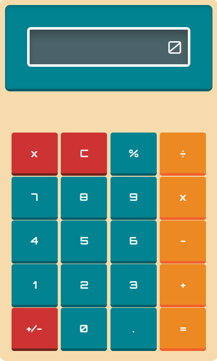

# calculator

A retro theme calc (short for calculator, btw) program built using HTML, CSS, and Javascript.

This project was made for the [The Odin Project](https://www.theodinproject.com/).

## Features
- Handles arithmetic operations.
- Allows to clear and delete single digits.
- Handles keyboard support on all devices.

## Demo
https://calsjunior.github.io/retro-calc/
